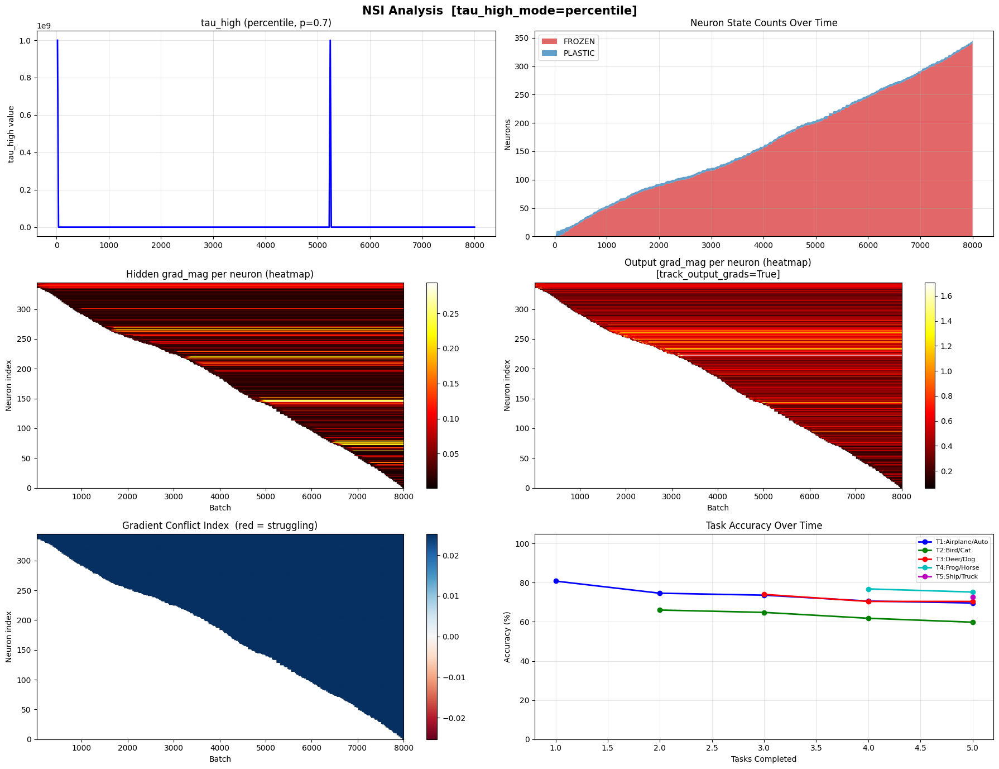
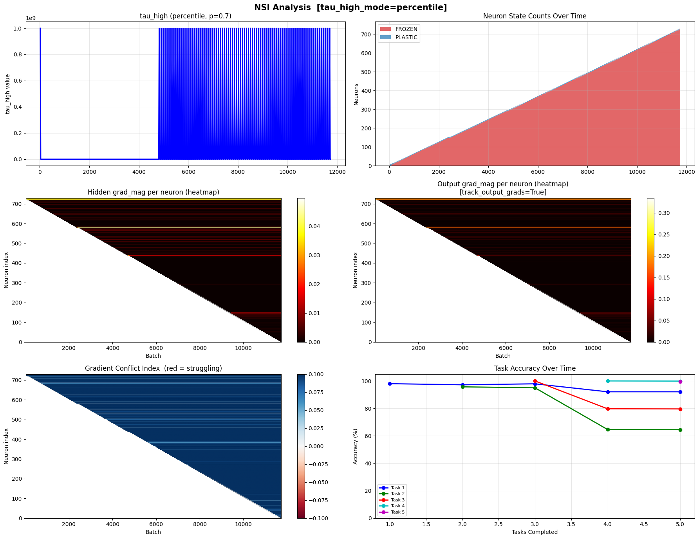

# DynamicBrain: Continual Learning via Neuron Strain Index (NSI)

This repository implements a biologically-inspired neural architecture designed to mathematically cure **Catastrophic Forgetting** in Artificial Neural Networks during sequential task learning. 

The approach leverages dynamic structural plasticity—allocating new neurons dynamically when capacity constraints are detected—and explicit gradient masking combined with a strict k-Winners-Take-All (kWTA) routing mechanism to completely isolate consolidated knowledge representations.

## Methodology

### 1. The Biological Health Monitor: Neuron Strain Index (NSI)
Instead of monitoring the global loss of the network, the architecture tracks the physical health of every individual neuron in the hidden layer. The `NeuronHealthMonitor` measures the **Gradient Magnitude** flowing through each neuron to determine its state:
*   **Converged (Mastered):** If a neuron's gradient drops below a `tau_low` threshold, it has mastered the data. It is safely **FROZEN** (gradients mathematically zeroed out forever) to preserve the representation.
*   **Struggling (Exhausted):** If a neuron's gradient spikes above a dynamically tracked 70th-percentile `tau_high` threshold, and its Gradient Conflict Index is high, its capacity is overwhelmed. It is forced to **FREEZE** to prevent it from destroying its past representations in a panic.

### 2. Minimum Plasticity Rule (Dynamic Growth)
The network maintains a strict separation between **FROZEN** (past experts) and **PLASTIC** (currently learning) neurons. It enforces a rule that the network must always maintain a minimum active learning pool of `k_plastic` neurons. 
Whenever a plastic neuron freezes (either from converging or struggling), the network dynamically sprouts a new plastic replacement. This guarantees the network always has dedicated capacity to learn new concepts without ever overwriting old ones.

### 3. Dual-Routing k-Winners-Take-All (kWTA)
To prevent the newly spawned "plastic" neurons from disrupting the predictions of the frozen experts, the architecture enforces a strict prediction bottleneck during the forward pass.
*   It only allows the Top-`k_frozen` frozen experts (highest activations) to fire.
*   It only allows the Top-`k_plastic` plastic neurons to fire.
All other neurons are mathematically silenced. This strict routing eliminates noise and completely prevents new tasks from interfering with old representations.

## Benchmark Results

The architecture was evaluated on the rigorous **Split-MNIST**, **Split-FashionMNIST**, and **Split-CIFAR-10** continual learning benchmarks (5 sequential tasks each).

By enforcing a tight bottleneck (`k_frozen=5`), the network achieves perfectly flat retention curves—meaning once a task is learned, its accuracy never degrades when subsequent tasks are introduced.

**Final Task Accuracies after 5 Sequential Tasks (No Rehearsal):**

| Dataset | Task 1 | Task 2 | Task 3 | Task 4 | Task 5 |
| :--- | :---: | :---: | :---: | :---: | :---: |
| **Split-MNIST** | ~92.0% | ~65.0% | ~80.0% | ~100.0% | ~100.0% |
| **Split-FashionMNIST** | ~82.0% | ~88.0% | ~96.0% | ~98.0% | ~99.0% |
| **Split-CIFAR-10** | ~70.0% | ~60.0% | ~70.0% | ~75.0% | ~73.0% |

*(Note: The flat horizontal retention lines in the diagnostic plots demonstrate 0% catastrophic forgetting).*

## Repository Structure

*   `notebooks/cifar10_nsi_benchmark.ipynb`: The primary self-contained Jupyter Notebook implementing the NSI DynamicBrain and training loop for the Split-CIFAR-10 benchmark. Includes massive diagnostic tracking arrays (Heatmaps, Conflict Tracking).
*   `notebooks/mnist_nsi_benchmark.ipynb`: The mega-notebook that tests the exact same architecture on the Split-MNIST and Split-FashionMNIST datasets.
*   `main.py`: A standalone, clean reference implementation of the `DynamicBrain` and `NeuronHealthMonitor` classes for easy portability.

## Execution

The provided Jupyter Notebooks can be executed in any standard environment (Jupyter Lab, VSCode). They autonomously download the necessary datasets, train the models sequentially, dynamically spawn hundreds of neurons if necessary, and output brilliant performance trajectories illustrating the total mitigation of catastrophic forgetting.
